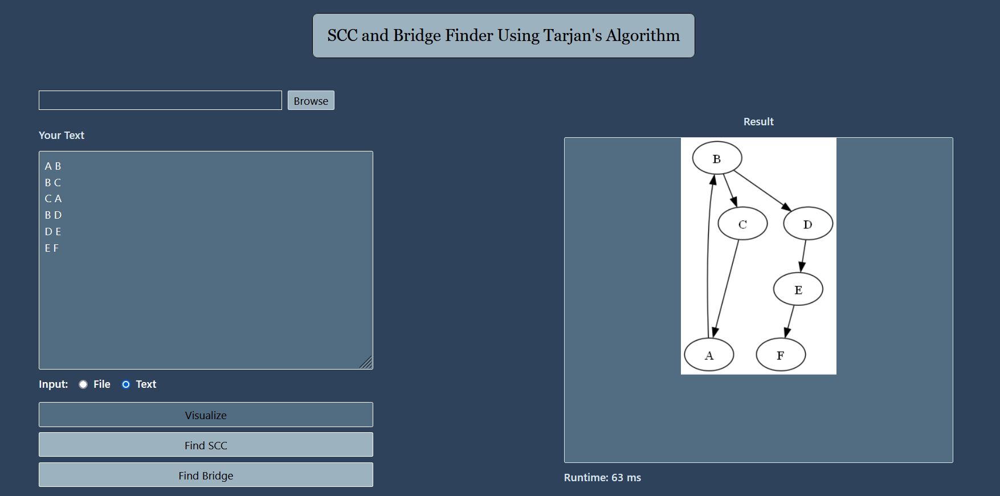
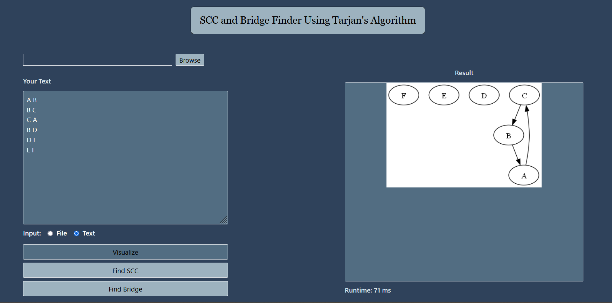

# Strongly Connected Components and Bridges Finder Using Tarjan's Algorithm
<br />

## Table of Contents
* [General Info](#general-information)
* [WebApp View](#webapp-view)
* [Additional Info](#additional-info)
* [How To Run](#how-to-run)
* [Tech Stack](#tech-stack)
* [References](#references)
* [Credits](#credits)

## General Information
A website that can find and visualize all strongly connected components (SCC) and bridges of a graph using Tarjan's Algorithm. The graph can come from the user's text input or txt file.
Text input and txt file content format:
```
A B
B C
C A
B D
D E
E F
``````
PS: For the txt file, there MUST BE a white space after the second alphabet on each line except for the last line, for example: A B{white space} and B C{white space}

## WebApp View
Graph Visualization
> 

SCC Visualization
> 

Bridges Visualization
> 

## How To Run
In your terminal, move to the frontend directory and run the frontend project using the commands:
```shell
cd frontend
npm run start

```
A website will appear if you run the project successfully! After that, move to the backend directory and run the backend project using the commands:
```shell
cd ..
cd backend
go run main.go

```
If you manage to run the backend successfully, you can start using the website!
In this website, you can input your graph using two options, which are the text input and txt file (using the browse button). After inputting your graph, you can click the circular button based on your input choice. After that, you can start visualizing your input graph using the `Visualize` button. Finally, you can find the SCCs and bridges of your graph by clicking the `Find SCC` button and `Find Bridge` button respectively.

## Additional Info
Graph is a data structure consisting of a finite set of vertices and edges. The difference between the graph data structure and the tree data structure is that the graph can have cycles or loops while the tree data structure cannot. In the context of depth-first search (DFS) traversal, there are mainly 4 types of edges in a graph, which are the tree edge, back edge, cross edge, and forward edge. A tree edge is an edge which is present in the tree obtained from performing a DFS traversal in a graph. A back edge is an edge connecting a vertex to one of its ancestors in the DFS tree that forms a cycle. A cross edge is an edge connecting u to v such that node u and node v have no ancestor or descendant relationship between them. Last, a forward edge is an edge connecting u to v such that node v is a descendant but not a part of the DFS tree.

Tarjan's algorithm is a type of graph algorithm for finding the strongly connected components (SCCs) if a directed graph. This algorithm uses DFS to identify the SCCs. It keeps a stack of vertices that have not been visited but not assigned to an SCC and uses two arrays to keep track of each vertex's discovery time and low-link value. A vertex's low-link value is the shortest discovery time of any vertex reachable from it, including itself. When the DFS returns from visiting a vertex and its descendants, if the low-link value of that vertex has the same value as its discovery time, we can conclude that the vertex must be the root of an SCC which consists of that vertex and other vertices above it on the stack. For finding bridges, there is a slight modification to the algorithm. In the modified algorithm, the low-link value of a vertex is used to determine if an edge is a bridge. If the low-link value of a vertex v is greater than the discovery value value of its parent, we can conclude that the edge between v and its parent is a bridge.

Tarjan's algorithm has a time complexity of O(V+E). V is the number of vertices while E is the number of edges in a graph. The reason for this time complexity is that this algorithm performs a single DFS traversal of a graph which consists of visiting every vertex and edge once. Also, the operations that are done in this algorithm takes constant time.

## Tech Stack
### Programming Language
* Javascript
* Go
### Framework
* React.js (Front End)
* Gin (Back End)
### Library
* fmt (Go Standard Library) : for formatting input and output (mainly for testing and debugging)
* os (Go Standard Library) : for interacting with operating system (especially for running external commands such as dot command)
* strings (Go Standard Library) : for manipulating strings
* image (Go Standard Library) : for working with images
* github.com/dominikbraun/graph and github.com/dominikbraun/graph/draw (External Package) : for working with graphs and drawing graphs

## References
* https://www.geeksforgeeks.org/tree-back-edge-and-cross-edges-in-dfs-of-graph/
* https://www.geeksforgeeks.org/tarjan-algorithm-find-strongly-connected-components/
* https://www.geeksforgeeks.org/bridge-in-a-graph/ 

## Credits
This project is implemented by Bill Clinton (13521064).

